# EverydayElastic - Architecture Documentation

## System Architecture

```mermaid
graph TB
    subgraph "User Layer"
        User[👤 User Browser]
        Slack[💬 Slack Workspace]
    end

    subgraph "Application Layer"
        subgraph "Frontend - Next.js 15.5.5"
            Landing[🏠 Landing Page]
            Copilot[💡 Copilot Interface]
            ConvMgmt[📝 Conversation Management]
        end

        subgraph "Backend - FastAPI 0.115.0"
            Routes[🛣️ Chat Routes<br/>/chat/completions]
            Actions[⚡ Actions Handler<br/>/chat/actions]
            Status[📊 Integration Status<br/>/integrations/status]
            
            subgraph "Service Layer"
                ElasticClient[🔍 Elasticsearch Client]
                VertexClient[🤖 Vertex AI Client]
                SlackClient[💬 Slack Client]
                Workflows[⚙️ Workflows Engine]
            end
            
            Logging[📝 Structured Logging]
            Metrics[📈 Prometheus Metrics]
        end
    end

    subgraph "External Services"
        subgraph "Elasticsearch Cloud"
            ESIndex[(📚 knowledge-base index<br/>semantic_text + BM25)]
            ESInference[🧠 Open Inference API<br/>Embeddings + Reranking]
        end

        subgraph "Google Vertex AI"
            Gemini[✨ Gemini 2.5 Flash Lite<br/>Text Generation]
            Embeddings[🔢 Embeddings API]
            Reranking[📊 Reranking API]
        end

        SlackAPI[💬 Slack Web API<br/>chat.postMessage<br/>Block Kit]
    end

    subgraph "Infrastructure"
        CloudRun[☁️ Google Cloud Run]
        SecretMgr[🔐 Secret Manager]
        CloudLog[📋 Cloud Logging]
    end

    %% User interactions
    User -->|HTTPS| Frontend
    User -.->|Notifications| Slack

    %% Frontend to Backend
    Landing --> Routes
    Copilot --> Routes
    Copilot --> Actions
    ConvMgmt --> Routes

    %% Backend routing
    Routes --> ElasticClient
    Routes --> VertexClient
    Routes --> Workflows
    Actions --> SlackClient
    Status --> ElasticClient
    Status --> VertexClient
    Status --> SlackClient

    %% Service layer to external services
    ElasticClient --> ESIndex
    ElasticClient --> ESInference
    VertexClient --> Gemini
    VertexClient --> Embeddings
    ESInference --> Reranking
    SlackClient --> SlackAPI
    Workflows --> SlackClient
    SlackAPI -.->|Webhook| Slack

    %% Observability
    Backend --> Logging
    Backend --> Metrics
    Logging --> CloudLog

    %% Infrastructure
    Frontend -.->|Deployed on| CloudRun
    Backend -.->|Deployed on| CloudRun
    Backend -.->|Secrets| SecretMgr

    style User fill:#e1f5ff
    style Slack fill:#e1f5ff
    style Frontend fill:#fff4e1
    style Backend fill:#ffe1f5
    style ElasticClient fill:#d4f1d4
    style VertexClient fill:#d4f1d4
    style SlackClient fill:#d4f1d4
    style Workflows fill:#d4f1d4
    style ESIndex fill:#f0e1ff
    style Gemini fill:#f0e1ff
    style SlackAPI fill:#f0e1ff
    style CloudRun fill:#e1e1e1
```

## Data Flow

### 1. Chat Completion Flow

### 2. Slack Action Flow

```mermaid
sequenceDiagram
    actor User
    participant Frontend
    participant Backend
    participant SlackClient
    participant SlackAPI as Slack Web API
    participant Webhook as Slack Webhook
    participant Slack as Slack Workspace

    User->>Frontend: Click "📤 Send to sev-1-war-room"
    Frontend->>Backend: POST /chat/actions<br/>{action: "slack_webhook", payload}
    
    Backend->>Backend: execute_follow_up()
    Backend->>SlackClient: post_slack_update(payload)
    
    alt Slack Web API Available
        SlackClient->>SlackClient: Format rich blocks (Block Kit)
        SlackClient->>SlackAPI: POST chat.postMessage<br/>Authorization: Bearer token
        SlackAPI-->>Slack: Message with rich formatting
        SlackAPI-->>SlackClient: Success response
    else Web API Failed - Fallback
        SlackClient->>SlackClient: Format simple text
        SlackClient->>Webhook: POST webhook URL<br/>{text: message}
        Webhook-->>Slack: Simple text message
        Webhook-->>SlackClient: Success response
    end
    
    SlackClient-->>Backend: Success
    Backend-->>Frontend: ActionResponse<br/>{status: "ok", message}
    Frontend->>Frontend: Show success feedback
    Frontend-->>User: "Slack update sent successfully"
```

## Technology Decisions

### Why Elasticsearch?
- **Hybrid Search**: Combines keyword (BM25) and semantic (vector) search
- **Open Inference API**: Native integration with Vertex AI embeddings and reranking
- **Scalability**: Cloud deployment handles large document corpus (7,800+ docs)
- **Real-time**: Sub-second query latency

### Why Vertex AI Gemini?
- **Context Window**: 2M tokens supports large context from search results
- **Grounded Responses**: Citations prevent hallucination
- **Speed**: Flash variant optimized for latency (< 2s response time)
- **Cost**: Efficient pricing for production workloads

### Why FastAPI?
- **Async**: Native async/await for concurrent I/O operations
- **Type Safety**: Pydantic models ensure request/response validation
- **Performance**: One of the fastest Python frameworks
- **Developer Experience**: Auto-generated OpenAPI docs

### Why Next.js?
- **Server Components**: Optimal performance with SSR
- **App Router**: Modern routing with layouts and loading states
- **TypeScript**: Type-safe React development
- **Build Optimization**: Automatic code splitting and bundling

### Why Slack Integration?
- **Collaboration**: Direct incident notification to team channels
- **Rich Formatting**: Block Kit provides structured, actionable messages
- **Existing Workflows**: Teams already use Slack for incident management
- **Bi-directional**: Foundation for future Slack → Search commands

## Performance Characteristics

| Operation | Latency | Notes |
|-----------|---------|-------|
| Elasticsearch Query | 400-800ms | Includes embedding + reranking |
| Vertex AI Generation | 1-2s | Depends on response length |
| End-to-end Chat | 2-3s | Total time from query to response |
| Slack Notification | 200-500ms | Web API, async operation |

## Security Considerations

1. **Authentication**
   - Service account for Vertex AI (Workload Identity)
   - API keys for Elasticsearch (stored in Secret Manager)
   - OAuth tokens for Slack (with refresh mechanism)

2. **Data Protection**
   - HTTPS everywhere
   - No user credentials stored
   - Secrets injected via environment variables

3. **Access Control**
   - Backend validates all requests
   - CORS configured for frontend origin
   - Rate limiting on API endpoints (TODO)

## Scalability

- **Horizontal Scaling**: Cloud Run auto-scales based on request volume
- **Stateless Design**: No session state in backend enables scaling
- **Caching**: Browser caching for static assets
- **Connection Pooling**: Reused HTTP clients for external services

## Monitoring & Observability

- **Structured Logging**: JSON logs with contextual fields
- **Metrics**: Prometheus metrics exposed at `/metrics`
- **Tracing**: OpenTelemetry integration (ready for Cloud Trace)
- **Health Checks**: `/health` and `/integrations/status` endpoints

## Future Enhancements

1. **Retrieval**
   - Hybrid search parameter tuning
   - Query expansion with synonyms
   - Multi-lingual support

2. **Generation**
   - Streaming responses (SSE)
   - Function calling for structured data
   - Multi-turn conversation memory

3. **Actions**
   - Slack slash commands (bi-directional)
   - Auto-escalation workflows
   - PagerDuty integration

4. **Infrastructure**
   - Multi-region deployment
   - Redis for caching
   - Rate limiting and quotas
